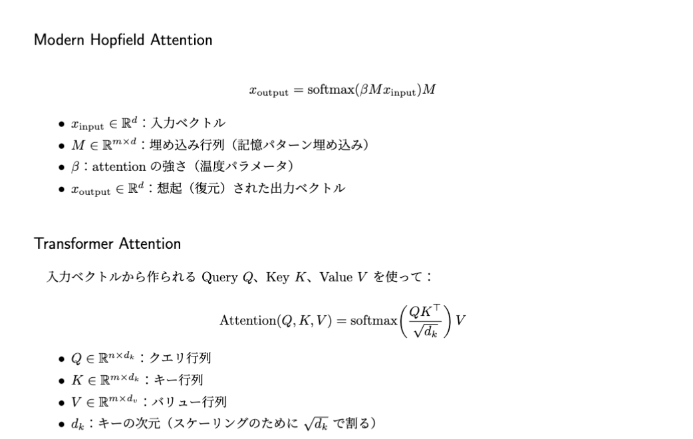
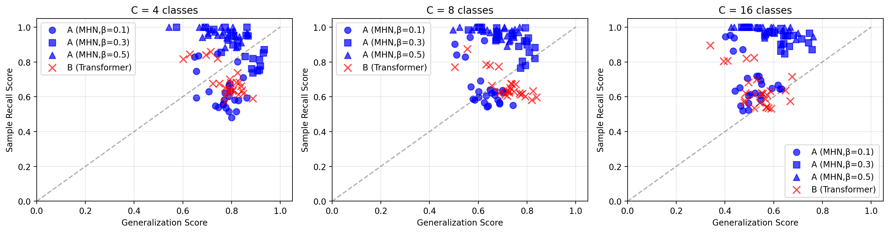

# Hopfield vs. Transformer Benchmark Suite

## 概要
Modern Hopfield（記憶埋め込み、学習なし）と Transformer（K≠V のデノイズ学習）を
同一条件で比較できるベンチマーク環境です。

ノイズの入った入力データを与え、モデルがどの程度「元の正しいパターン」を復元できるかを評価します。
評価指標としては「入力と正解ラベルの一致度（復元精度、オーバーラップ）」を用いています。

α（パターン数/次元の比）、β（attentionの強さ）、ノイズ強度を変化させながら、
復元性能の変化をグラフで可視化できます。


- Modern Hopfield とは  
Modern Hopfield Network (MHN) は「検索型メモリ」として動作します。
入力ベクトル（クエリ）に対して、保存されたパターン（キー・バリュー）の中から最も関連するものを検索し、対応する記憶を呼び出す仕組みです。数理的にはTransformerのAttention機構と同型（K=Vとしたもの）であり、両者は「検索による情報取得」という共通の枠組みで理解できます。

  


---

## 実行方法

### 1. インストール
```bash
pip install -r requirements.txt
```

### 2. 実行方法
- Jupyter Notebook を使う場合:
```bash
jupyter notebook attention_hopfield_vs_transformer.ipynb
```

- Python スクリプトを使う場合（例）:
```bash
python run_benchmark.py --variant A --alpha 0.5 --beta 2.0 --noise 0.1
```

### 3. variant の指定
- `variant=A` : Modern Hopfield (学習なし)
- `variant=B` : Transformer (デノイズ学習)

---

## 出力
- CSV: `out/records.csv`
- 図版: `out/summary_perf.png`,`out/summary_2d.png`
- 出力サンプル:




---

## 再現性
- 乱数 seed を固定
- 実行ごとに CSV/PNG を自動保存
- `requirements.txt` で依存関係を明示

---

## Appendix: 補足資料（研究内容）

本リポジトリには、修士研究で用いた研究寄りのノートブックや実験成果も併せて公開しています。

- **Hopfield.ipynb**  
  Hopfieldモデルの多パターン記憶を理論的に解析し、記憶を思い出す過程を視覚化。  
  → [view on GitHub](appendix/Hopfield.ipynb)

---

## Appendix: 計算手法

- **パラメータ掃引と相図可視化**  
  モデル条件（α, β, ノイズ強度など）をグリッドで変化させ、性能をヒートマップ・相図として可視化

- **ノイズ耐性評価**  
  データにノイズを加えて復元精度を計測し、ロバスト性を評価

- **理論解析と数値実験の重ね合わせ**（Hopfield Analysis）
  統計的な理論カーブと実測結果を同一図に重ね、挙動の整合性を検証
  

